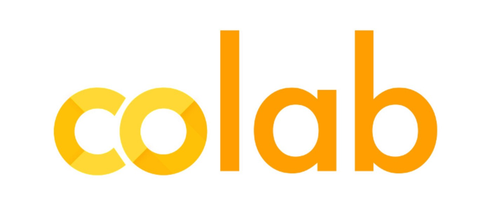
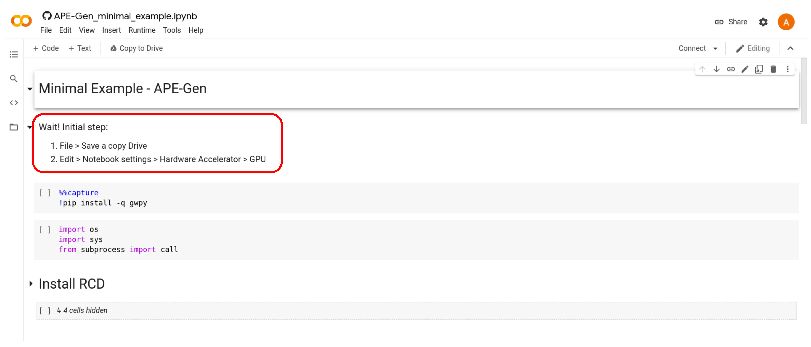

title: "Introduction Google Colab"
author: "Andre Fonseca"
date: "10/8/2021"

## Google Colab

Colaboratory, or “Colab” for short, is a product from Google Research. Colab allows anybody to write and execute arbitrary python code through the browser, and is especially well suited to machine learning, data analysis and education.

## Why should I use it?

## Setup enviroment

To assess https://colab.research.google.com/

1. Login on Google Colab

2. Connecting with ISMCO repository

In order to connect with ISMCO repository you will need to copy and paste the repository address: https://github.com/AntunesLab/ISMCO-2021-TUTORIAL/blob/main/T05_APE-Gen_tutorial.ipynb. Next, hit the search button. 

3. Copying APE-Gen_minimal_example to your own Google Drive

Congrats! If you are able to see the screenshot below, it means that you made it through the whole setup process! We are at the very end! **However,  there is a final step required.**

To avoid any potential conflicts among user sessions each student should have an individual notebook instance. To do so, we can follow the first lines on the  "APE-Gen_minimal_example" file.

> Wait! Initial step:
> 
> 1. File > Save a copy Drive
> 2. Edit > Notebook settings > Hardware Accelerator > GPU 